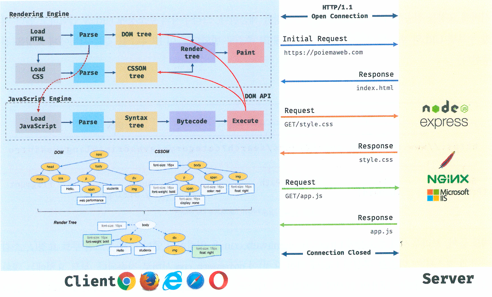
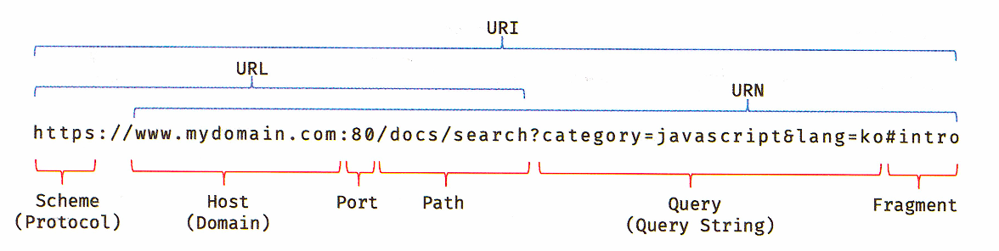
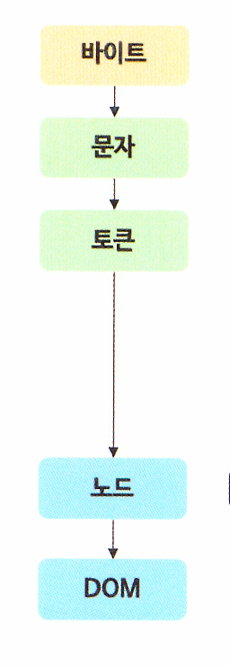
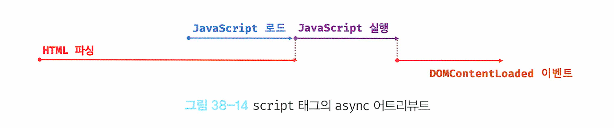
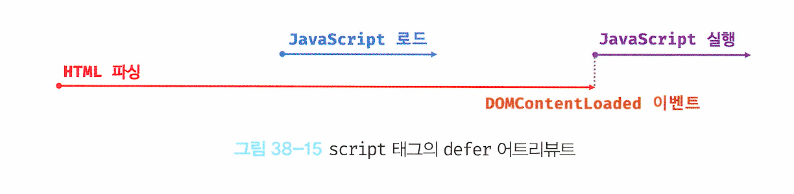

## 38장 브라우저의 렌더링 과정

### 1. 브라우저 렌더링

1. 브라우저의 주소창에 URL 입력 후 엔터를 누른다.
2. URL의 hostname이 DNS으로 전송된다.
3. DNS에서 IP주소로 변환되어 리턴된다.
4. 해당 IP주소를 가지는 서버에게 HTML, CSS, 자바스크립트, 이미지, 폰트파일 등 렌더링에 필요한 리소스를 요청하고 서버로부터 응답을 받는다.
5. 브라우저의 렌더링 엔진은 서버로부터 응답된 HTML과 CSS를 파싱하여 DOM과 CSSOM을 생성하고 이들을 결합하여 렌더 트리를 생성한다.
6. 브라우저의 자바스크립트 엔진은 서버로부터 응답된 자바스크립트를 파싱하여 AST를 생성하고 바이트코드로 변환하여 실행한다. 이 때 자바스크립트는 DOM API를 통해 DOM이나 CSSOM을 변경할 수 있다. 변경된 DOM과 CSSOM은 다시 렌더 트리로 결합된다.
7. 렌더 트리를 기반으로 HTML 요소의 레이아웃(위치와크기)을 계산하고 브라우저 화면에 HTML요소를 페인팅한다.

+) 추가

- 브라우저의 핵심 기능은 필요한 리소스를 서버에 요청하고 응답받아 브라우저에 시각적으로 렌더링하는 것이다.
- 루트 요청은 암묵적으로 정적파일인 index.html을 응답하도록 되어있다.
- 정적파일이나 정적/동적 데이터를 요청할 수도 있다.

### 2. HTTP 1.1/2.0

HTTP는 웹에서 브라우저와 서버가 통신하기 위한 프로토콜이다.

##### HTTP 1.1

- 커넥션당 하나의 요청과 응답만 처리한다. (여러개의 요청을 한 번에 전송/응답할 수 없음)
- 요청할 리소스에 개수에 비례하여 응답 시간도 증가한다.

##### HTTP 2.0

- 커넥션당 여러개의 요청과 응답을 처리할 수 있다.
- 1.1보다 페이지 로드 속도 50% 향상

### 3. HTML 파싱과 DOM 생성

서버가 응답한 index.html은 문자열로 이루어진 순수한 텍스트이다.
HTML 문서를 브라우저에 시각적으로 렌더링하려면 해당 문서를 브라우저가 이해할 수 있도록 DOM 자료구조를 생성한다.

1. 브라우저의 요청을 받은 서버는 HTML 파일을 메모리에 저장한다음 메모리에 저장된 바이트를 인터넷을 경유하여 응답한다.
2. 브라우저는 HTML 문서를 바이트 형태로 받은 후 문자열로 변환한다.
3. 문자열로 변환된 문서를 읽어 문법적 의미를 갖는 토큰으로 분해한다.
4. 토큰을 객체로 변환하여 노드를 생성한다. 노드는 이후 DOM을 구성하는 기본 요소가 된다.
5. 노드들이 부자관계를 반영하여 트리 자료구조를 구성한다. 이것을 DOM이라고 한다.

→ DOM은 HTML 문서를 파싱한 결과물이다.

### 4. CSS 파싱과 CSSOM 파싱

렌더링 엔진은 HTML을 한줄씩 순차적으로 파싱하여 DOM을 생성해나간다.
그러다 Link 태그나 style 태그를 만나면, DOM 생성을 일시중단하고 CSS파일을 서버에 요청하여 HTML과 동일하게 파싱한다.
이과정에서 CSSOM을 생성한다.
이후 HTML 파싱이 중단된 지점부터 파싱 하기 시작하여 DOM 생성을 재개한다.

#### 5. 렌더 트리 생성

렌더링 엔진은 서버로부터 받은 HTML과 CSS를 파싱하여 DOM과 CSSOM를 생성한다.
DOM과 CSSOM는 렌더링을 위해 렌더트리로 결합된다.
렌더트리는 렌더링을 위한 트리구조의 자료구조다.
따라서 브라우저 화면에 렌더링 되지 않는 노드와 CSS에 의해 렌더링 되지 않는 노드는 포함하지 않는다.
렌더트리는 브라우저화면에 렌더링되는 노드만으로 구성된다.

지금까지 살펴본 브라우저의 렌더링 과정은 반복해서 실행될수있다.
예를들어, 다음과 같은 경우 레이아웃 계산과 페인팅이 반복되어 실행된다.

- 자바스크립트에 의한 노드 추가 또는 삭제
- 브라우저 창의 리사이징에 의한 뷰포트 크기 변경
- 레이아웃 변경을발생시키는 (width/height,margin,padding,border,display.position,top/right/bottom/Left)등 의 스타일 변경

→ 위와 같은 리렌더링은 비용이많이드는, 성능에 악영향을 주는 작업이다. 가급적 주의하자.

#### 6. 리플로우와 리페인트

자바스크립트 코드에 DOM이나 CSSOM을 변경하는 DOMAPI가 사용된 경우 DOM이나 CSSOM이 변경된다.
이때 변경된 DOM과 CSSOM은 다시 렌더트리로 결합되고 변경된 렌더트리를 기반으로 레이아웃과 페인트 과정을 거쳐 브라우저의 화면에 다시 렌더링 한다. 이를 리플로우, 리페인트라고 한다.

리플로우는 레이아웃 계산을 다시 하는 것을 말하며, 노드 추가/삭제, 요소의 크기/위치 변경, 윈도우 리사이징 등 레이아웃에 영향을 주는 변경이 발생한 경우에 한하여 실행된다.

리페인트는 재결합된 렌더트리를 기반으로 다시 페인트를 하는 것을 말한다.
따라서 리플로우와 리페인트가 반드시 순차적으로 동시에 실행되는 것은 아니다.
레이아웃에 영향이 없는 변경은 리플로우없이 리페인트만 실행된다.

### 7. async/defer 어트리뷰트

script 태그 위치에 따라 HTML 파싱이 블로킹되어 DOM 생성이 지연될수 있다.
따라서 Script 태그의 위치는 중요한 의미를갖는다.

자바스크립트 파싱에 의한 DOM 생성이 중단 되는 문제를 근본적으로 해결하기 위해 HTML5부터 script태그에 async와 defer 어트리뷰트가 추가되었다.

async와 defer 어트리뷰트를 사용하면 HTML파싱과 외부자바스크립트 파일의 로드가 비동기적으로 진행된다.
하지만 자바스크립트의 실행 시점에 차이가 있다.

##### async

여러개의 script 태그에 async어트리뷰트를 지정하면 script 태그의 순서와는 상관없이 로드가 완료된
자바스크립트부터 먼저 실행되므로 순서가 보장되지않는다.

##### defer

async 어트리뷰트와 마찬가지로 HTML파싱과 외부자바스크립트파일의 로드가 비동기적으로 진행된다.
단, 자바스크립트의 파싱과 실행은 HTML파싱이 완료된직후, 즉 DOM 생성이 완료 된 직후 진행된다.
