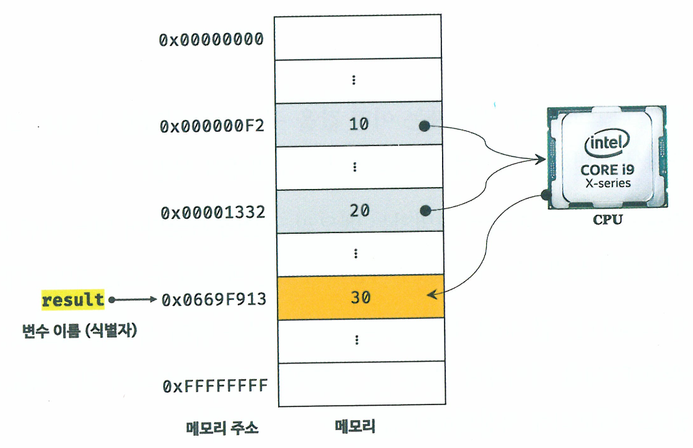
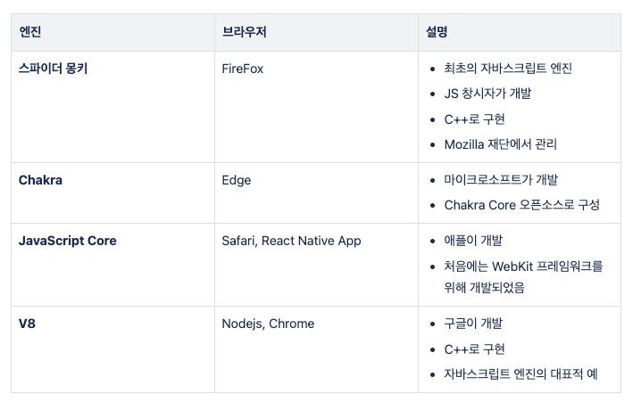

## 4장 변수

#### 1. 변수

개발자가 메모리 주소를 통해 값에 직접 접근하는 것은 치명적 오류를 발생시킬 가능성이 높다.
프로그래밍에서는 기억하고 싶은 값을 메모리에 저장하고, 저장된 값을 읽어 재사용하기 위해 변수라는 메커니즘을 제공한다.

개발자는 이제 변수로 메모리 주소를 직접 알 필요 없이 안전하게 값을 읽고 사용할 수 있다.

1. 변수 이름으로 참조 요청
2. 자바스크립트 엔진이 변수 이름과 매핑된 메모리 주소를 통해 메모리 공간에 접근
3. 저장된 값을 반환한다.


(result = 10+20 이 메모리에 담기는 과정)

여기서 변수 이름은 **식별자**라고도 하는데, 식별자는 값이 저장되어있는 메모리 주소를 기억하고 있다.
변수를 var, let, const 키워드로 변수를 선언하므로써 자바스크립트 엔진에게 식별자의 존재를 알린다.

자바스크립트 엔진은 변수 선언을 선언 단계와 초기화 단계에 거쳐 수행한다.
선언 단계를 통해 변수 이름을 등록하고, 초기화 단계를 통해 **암묵적으로 undefined**를 할당한다.

→ 변수 이름을 비롯한 모든 식별자는 실행 컨텍스트에 등록된다.

#### 2. 호이스팅

var는 여러 단점이 있는데 그 중 하나는 호이스팅이 가능하다는 점이다.

```
console.log(`Before declare: ${code}`);  // 'Before declare: undefined'
var code = 10;
console.log(`After declare: ${code}`);  // 'After declare: 10'
```

호이스팅은 선언문이 코드의 선두로 끌어 올려진 것처럼 동작하는 자바스크립트 고유 특징을 말하는데,
자바스크립트 엔진은 변수 선언을 포함한 모든 선언문을 먼저 찾아내어 런타임 이전에, 소스코드의 평가 과정에서 실행한다. 그리고 소스코드 평가 과정이 끝나면 한 줄씩 순차적으로 실행한다.

##### 💡그렇다면 let과 const는 호이스팅이 안되는 것일까?

호이스팅은 js 고유 특징이므로 let, const 키워드도 호이스팅한다.
하지만 TDZ (Temporal Dead Zone)에 영향을 받기 때문에 Before declare에서 참조 에러가 발생한다.

ref.

- https://developer.mozilla.org/en-US/docs/Web/JavaScript/Reference/Statements/let#temporal_dead_zone_tdz
- https://ui.toast.com/weekly-pick/ko_20191014

##### 💡 브라우저 별 엔진 종류


